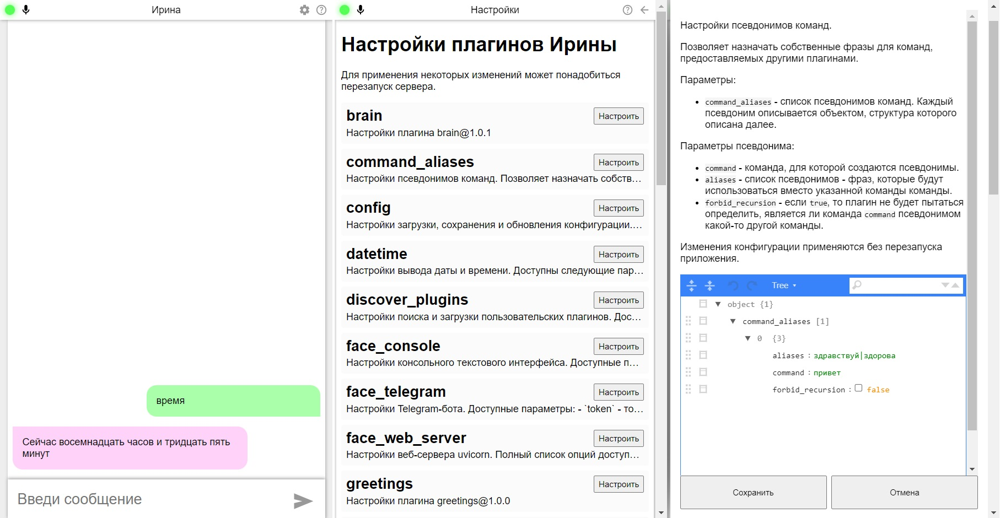

[](https://opensource.org/licenses/MIT)
[](https://github.com/AlexeyBond/Irene-Voice-Assistant/actions/workflows/tests.yml)
[](https://coveralls.io/github/AlexeyBond/Irene-Voice-Assistant)
[](https://github.com/AlexeyBond/Irene-Voice-Assistant/actions/workflows/mypy.yml)
[](https://github.com/AlexeyBond/Irene-Voice-Assistant/actions/workflows/pep8.yml)
[](https://github.com/AlexeyBond/Irene-Voice-Assistant/actions/workflows/docker-image.yml)

Это форк/ремейк [оригинальной Ирины](https://github.com/janvarev/Irene-Voice-Assistant)
от [@janvarev](https://github.com/janvarev).

Отличия от оригинальной версии:

- более гибкая **архитектура**.
  При разработке этого форка я стремлюсь к тому, чтобы как можно больше функциональности можно было изменить, заменить,
  расширить или настроить без вмешательства в исходный код приложения.
  Для этого, в частности, большая часть функциональности вынесена в плагины и может быть заменена или расширена
  дополнительными плагинами.
  Например, большинство плагинов от оригинальной версии (формат которых отличается от каноничного формата плагинов для
  этого форка) поддерживаются за счёт
  [плагина-загрузчика оригинальных плагинов](./irene/compatibility/compatibility_plugin.py).
- приложение более **адаптировано для распространения** через установщики/пакетные менеджеры.
  Предусмотрена возможность разделения пользовательских (принадлежащих пользователю и хранящихся на его устройстве) и
  встроенных (распространяемых вместе с приложением, управляемых автором приложения) данных и плагинов.
  Это позволяет распространять приложение с набором предварительно загруженных данных (например, моделей для TTS),
  встроенных плагинов и файлов настроек по-умолчанию в виде неизменяемого пакета (например, Docker-образа).
  При этом, сохраняется возможность обновлять приложение не затрагивая пользовательские файлы.
- более гибкий, эффективный и [задокументированный **сетевой протокол**](./doc/client-server-protocol.md) для работы с
  клиентскими программами и устройствами.
  Плагины могут расширять протокол для использования функций новых клиентов.
  Основной недостаток - отсутствие совместимости с клиентами оригинальной версии.
- единый [**веб-интерфейс**](./README.md#Веб-интерфейс), позволяющий работать с сервером в различных режимах плюс
  управлять настройками.
- локальный **голосовой интерфейс, web-интерфейс и Telegram-бот** реализованы **в виде плагинов** и могут работать
  одновременно в одном процессе.
- поддерживается голосовой **вывод на разных языках**.
  Используется в плагине переводчика.
  Для работы нужно настроить и включить голосовые профили
  (см. [plugin_voice_profiles.py](./irene/embedded_plugins/plugin_voice_profiles.py)).
  Пока поддерживается только ограниченное количество языков (см. [languages.py](./irene/constants/languages.py)).

## Запуск

### Через Docker

На данный момент наиболее предпочтительным способом запуска Ирины является запуск её из официального Docker-образа,
[доступного на DockerHub](https://hub.docker.com/r/alexeybond/irene).

Стабильная версия Ирины доступна в виде Docker-образа (для linux/amd64 и linux/arm64) и может быть запущена следующей
командой:

```shell
docker run --rm -it --publish 8086:8086 -v "$HOME/irene:/irene" \
  alexeybond/irene:latest
```

<details>
<summary>Более свежая версия</summary>
Версия, собранная из ветки master, всегда доступна по тегу nightly:

```shell
docker run --rm -it --publish 8086:8086 -v "$HOME/irene:/irene" \
  alexeybond/irene:nightly
```

</details>

Далее можно открыть [https://localhost:8086/](https://localhost:8086/) (или аналогичный адрес на том хосте, где был
запущен контейнер) и, разрешив использование самоподписанного сертификата, использовать Ирину через веб-интерфейс.

*Для работы с аудио вводом-выводом непосредственно из контейнера, контейнеру нужно предоставить права на работу с аудио
устройствами. См. [документацию по локальному вводу-выводу](./doc/local-face.md#Docker)*

Docker-образ использует HTTPS с самоподписанным сертификатом для облегчения использования веб-интерфейса на удалённой
машине - захват микрофона на страницах, расположенных на удалённых машинах с небезопасным подключением не работает. Если
использовать HTTPS по тем или иным причинам не нужно, или нужно использовать свой сертификат, то можно удалить или
изменить параметры `ssl_certfile` и `ssl_keyfile` в настройках плагина `face_web_server` - через веб-интерфейс или
изменив файл `config/face_web_server.yaml` в папке с настройками.

Приложение будет хранить свои настройки и другие данные в папке, смонтированной к пути `/irene`
(в примере выше - `$HOME/irene`).

Дополнительные плагины можно класть в подпапку `plugins` внутри папки смонтированной по пути `/irene`
(в примере выше это будет `$HOME/irene/plugins`). Дополнительные зависимости для плагинов можно установить следующей
командой:

```shell
docker run -it --rm --entrypoint pip -v "$HOME/irene:/irene" alexeybond/irene:latest install -t /irene/deps <имя_зависимости>
```

Или если для плагина есть список зависимостей в виде файла `requirements.txt`:

```shell
cat путь/к/requirements.txt | \
  docker run -i --rm --entrypoint pip -v "$HOME/irene:/irene" alexeybond/irene:latest install -t /irene/deps -r /dev/stdin
```

### Из исходников

*Работоспособность с версиями python<3.9 не гарантирована.*

Перед запуском из исходного кода следует установить зависимости следующей командой:

```shell
pip install -r requirements.txt
```

*Эта команда установит все зависимости, какие только могут понадобиться для работы любых плагинов, доступных в этом
репозитории. Если Вы не собираетесь использовать некоторые плагины, то от установки некоторых зависимостей можно
отказаться, отредактировав файл `requirements.txt`. Например, если Вы не собираетесь использовать TTS-движок Silero, то
можно отказаться от установки библиотеки torch, которая занимает много места и времени.*

Для работы веб-интерфейса, нужно собрать его. Для этого понадобится node.js (версии 16.17.0 или выше) и npm. Сборка
осуществляется следующими командами:

```shell
cd ./frontend
npm ci && npm run build
cd ..
```

После установки зависимостей, запустить приложение можно следующей командой:

```shell
python3 -m irene
```

По-умолчанию, приложение создаст папку `irene` в домашней папке текущего пользователя и будет хранить там настройки и
другие данные. Расположение этой папки можно изменить передав переменную окружения `IRENE_HOME`:

```shell
IRENE_HOME="$PWD/irene-home" python3 -m irene
```

Запустить приложение с консольным интерфейсом можно следующей командой:

```shell
python3 -m irene -T console
```

Такая форма команды запуска перепишет часть текущих настроек, так что их придётся откатить вручную.

Для просмотра дополнительных параметров командной строки можно использовать следующую команду:

```shell
python3 -m irene --help
```

### Поддерживаемые команды и плагины

Плагины, доступные по-умолчанию реализуют следующие команды:

- "привет"
- "дата", "время"/"сколько времени"
- "брось/подбрось монету/кость"
- "(поставь) таймер"
- "скажи/озвучь/буфер"
- "игра больше меньше"
- "как по-<язык> будет <фраза>"/"переведи на <язык> <фраза>"

См. [embedded_plugins](./irene/embedded_plugins).

Поддерживается следующие TTS движки:

- pyttsx (не работает в Docker-версии, не работает, как минимум, в некоторых Linux'ах)
- Silero V3

Дополнительные плагины можно расположить в папке `plugins` папки данных Ирины (упомянутой ранее `IRENE_HOME` или папки
`/irene` в Docker-контейнере). Совместимость с плагинами, написанными для оригинальной Ирины не является полной.
Инструкция по написанию новых плагинов доступна [здесь](doc/plugin-dev-guide.md).

## Веб-интерфейс

Веб-интерфейс позволяет взаимодействовать с ассистентом голосом или при помощи текстовых сообщений, а так же
редактировать настройки плагинов через графический интерфейс:



Имеется возможность управлять внешним видом интерфейса и набором используемых методов ввода-вывода
(см. настройки плагина `web_face_frontend`) а так же управления доступом к различным ресурсам на веб-сервере
(см. настройки плагина `web_authentication`), например, для ограничения доступа к чтению/изменению настроек для случаев
когда веб-сервер доступен из публичной сети.

## Telegram-бот

С Ириной можно взаимодействовать через Telegram.
Для начала работы достаточно зарегистрировать бота при помощи [BotFather](https://t.me/BotFather), указать токен в
настройках плагина `face_telegram` и перезапустить приложение.

По-умолчанию, бот будет работать только с авторизованными пользователями.
Чтобы авторизовать пользователя, воспользуйтесь инструкциями к плагину
[`telegram_auth`](./irene_plugin_telegram_face/plugin_telegram_auth.py).
Чтобы бот работал с любыми пользователями без авторизации, плагин `telegram_auth` можно отключить.

По-умолчанию, бот будет как реагировать на текстовые команды, так и распознавать голосовые сообщения и отвечать
голосовыми сообщениями дублируя содержимое сообщения текстом.
Это поведение можно настраивать отключая/включая плагины `telegram_input_audio`, `telegram_output_audio`,
`telegram_io_plaintext` и меняя их настройки.

## Клиент для ESP32

В версии 0.5.0 добавлен (пока экспериментальный) способ использования устройств на контроллерах ESP32 в качестве
клиентов для сервера Ирины.
Подробности с.м. в README [в папке подпроекта](esp32-client).
